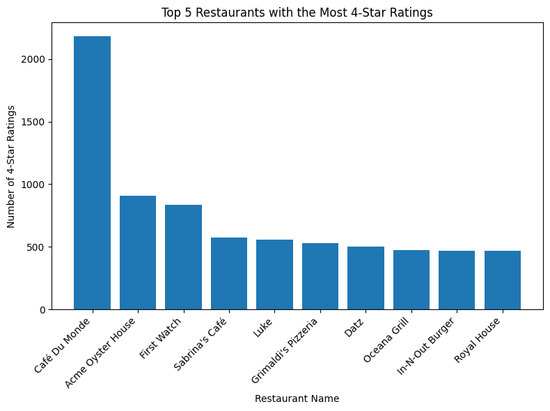
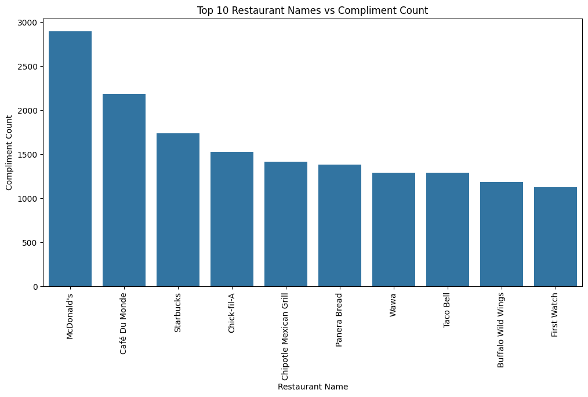

# Food Tourism: Personalized Restaurant Recommendations
## Group members:
* Nancy Maina
* Andrew Manwa
* Elsie Serem
* Samuel Gathogo
* Martin Omondi
  

# Project Overview
This project aims to create a personalized restaurant recommendation system that enhances the dining experience for users by leveraging machine learning and data analysis. The system provides tailored restaurant suggestions based on user preferences and restaurant attributes, helping users discover new culinary experiences with ease.

# Problem Statement
With the vast number of dining options available, making an informed choice for the perfect restaurant can be overwhelming. Traditional methods of filtering restaurants by location, cuisine, or amenities do not fully capture individual user preferences. This project seeks to address this challenge by developing a restaurant recommendation system that offers personalized suggestions based on a user’s specific tastes and past preferences.

# Objective
To develop a personalized restaurant recommendation system using content-based filtering and collaborative filtering techniques that provide users with relevant dining suggestions based on their preferences.

# Dataset
The dataset used in this project was scraped from Yelp and includes the following features for each business:

- **`business_id`**: Unique identifier for each restaurant.
- **`name`**: The name of the restaurant.
- **`address`**: Restaurant address.
- **`city`**: The city where the restaurant is located.
- **`state`**: The state where the restaurant operates.
- **`stars`**: The restaurant's rating.
- **`review_count`**: The number of reviews a restaurant has received.
- **`attributes`**: Various attributes of the restaurant such as ambience, parking, etc.
- **`categories`**: Types of cuisines offered.
- **`details`**: Descriptive information used to build recommendations.

# Data Preparation
 - **Renaming columns for clarity**.
- **Handling missing data** by removing or filling missing values.
- **Removing duplicate entries**.
- **Selecting relevant features** for the analysis.
- **Filtering rows** to include only relevant businesses (restaurants).

# Exploratory Data Analysis (EDA)
The dataset was analyzed to understand trends, including the distribution of restaurant ratings, popular restaurant categories, and the number of reviews per city. Visualizations such as histograms, box plots, and word clouds were used to illustrate key insights.
This EDA offered vital insights, identifying key dataset features. The dataset is primarily composed of  Restaurant establishments, highlighting a diverse range of cuisines. Nightlife venues are also notable, indicating a vibrant nightlife scene.
 
 The Blues City Deli is the clear leader in terms of customer satisfaction, as indicated by its high volume of 5-star ratings. The other restaurants, while receiving fewer ratings, still hold strong positive feedback.

 

 We also anlyzed the number of  Restaurant how they were rated according to the services and costumer satisfaction the top five rated four.Overall, Café Du Monde is the standout restaurant in terms of customer satisfaction with 4-star ratings, followed by a moderate distribution among the other restaurants.

 

 The bar chart shows that McDonald's has the highest compliment count, followed by Café Du Monde and Starbucks. Fast-food chains dominate the top spots, with Chick-fil-A, Chipotle, and others receiving notable mentions. The compliment counts gradually decrease across the list, with First Watch having the lowest among the top 10. This suggests that larger, well-known restaurant chains tend to receive more customer feedback and compliments.
 
 

# Modeling
## Collaborative Filtering:

Developed using the Surprise library’s SVD algorithm to predict user ratings based on similarities between users and restaurants.
Grid search and cross-validation were used to tune the model’s hyperparameters, improving its performance.

## Content-based Recommendation System:

Implemented using cosine similarity between TF-IDF vectors of restaurant descriptions to recommend restaurants based on user preferences.

## Deep Neural Networks:

A deep learning model was incorporated to further improve predictions, using restaurant embeddings and dense layers to predict user ratings.

# How to Run the Notebook
Prerequisites
Python (version 3.6 or later)
Jupyter Notebook
Required Python libraries: numpy, pandas, matplotlib, seaborn, scikit-learn, surprise, tensorflow
Steps to Run:
Clone this repository or download the .ipynb file.
Install the necessary Python libraries:

# Results

- **Content-Based Filtering Model**: Provides personalized recommendations by analyzing the similarity between restaurant descriptions and user preferences.
- **Collaborative Filtering Model**: Predicts restaurant ratings based on user behavior and provides additional recommendations.
- **Deep Learning Model**: Further refines these predictions by capturing complex interactions between user and restaurant features.

# Minimum Viable Product (MVP)
The system successfully addresses the cold start problem by switching between content-based recommendations and collaborative filtering based on user input. It provides a minimum viable product that offers restaurant recommendations in a user-friendly manner.

# Future Work
 - **User Feedback Integration**: Incorporate user feedback to continuously improve the recommendation system.
- **Geographical Expansion**: Expand the geographical coverage to include more cities and regions.
- **Advanced Visuals**: Add restaurant images and dish photos to enhance the user experience.
- **Real-time Updates**: Enable real-time updates of restaurant information, including menu changes and opening hours.
- **Collaboration with Food Delivery Services**: Integrate with food delivery services to allow users to order directly from recommended restaurants in the list.

# Contributions
This project was developed by Andrew Manwa, Elsie Serem, Martin Omondi, Nancy Maina, and Samuel Gathogo. Contributions are welcome—please fork the repository and submit a pull request with proposed improvements.

# License
This project is licensed under the MIT License. 
